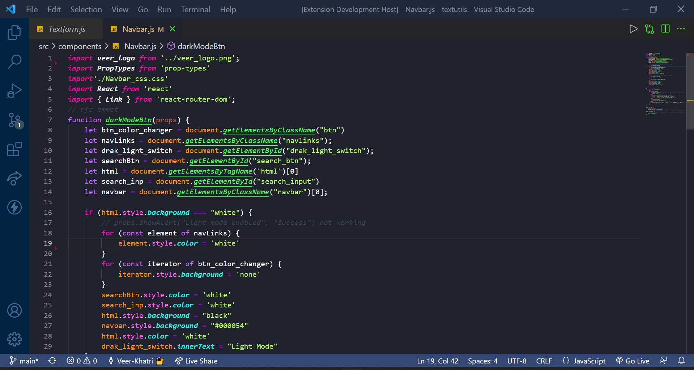

# VeerKhatri-Dracula-Dark-Theme

This theme is a mix of Dracula theme, Dark theme with some blue color and some fontStyle also. Want some changes? I have a YouTube channel you can comment me there


## Badges
Visual Studio Marketplace Installs


Visual Studio Marketplace Downloads


## Features

- Dark mode
- different font styles
- supports multiple languages
- rainbow🌈 theme  
- Blue and Green combo 


## Feedback

Want some changes?
I have a youtube channel you can reach me out there 
#### Link of Youtube Channel { https://www.youtube.com/channel/UCF_ny3E0irGu3AwZloTxDvw }

## Usage/Examples

These images contains react,Html and javascript as code 
Image 1

Image 2

Image 3



## Installation

Install theme with npm

```bash
   --install-extension VeerKhatri-Virtual-Tech-Station.dracula-dark-theme 

```
update theme with npm 

```bash
    --force--install-extension VeerKhatri-Virtual-Tech-Station.dracula-dark-theme 

```
## Authors

- [Veer Khatri](https://github.com/Veer-Khatri)


## License

[MIT](https://choosealicense.com/licenses/mit/)


## Support

For support, email virtualtechstation63@gmail.com or join our Slack channel.

